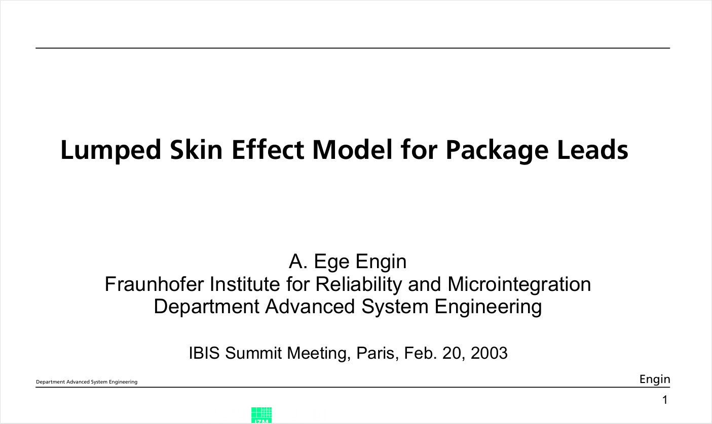
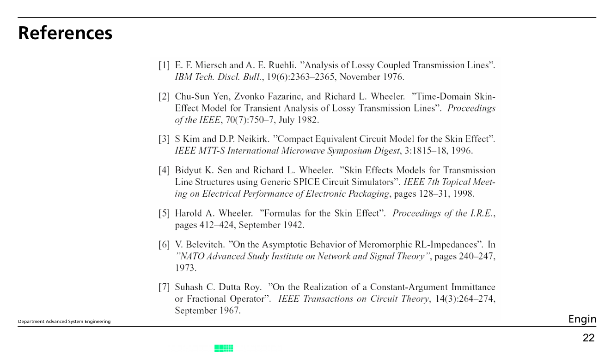

# 硬件笔记

## 如何在电路仿真中模拟集肤效应？

参考文献
[Lumped Skin Effect Model for Package Leads](https://github.com/aMoonRunner/hardwareNote/blob/main/files/Lumped%20Skin%20Effect%20Model%20for%20Package%20Leads.pdf)
中列举了一些方法和优缺点

下面是一些其他=它参考文献

[modeling-skin-effect-with-reduced-decoupled-rl-circuits](https://github.com/aMoonRunner/hardwareNote/blob/main/files/modeling-skin-effect-with-reduced-decoupled-rl-circuits.pdf)

